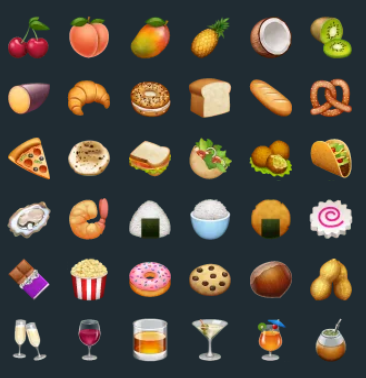

 

    
    <h3 align="center">Menu Generator</h3>
  

     
      <h5 align="center">Developed by:</h5>
        

          <a href="https://github.com/israelld">
            
             
          
          <b>Israel Dias</b>
          
          </a>
        

       
  

## Índice

* [Overview](#overview) 
* [Functionalities](#functionalities)
* [Technologies and Tools](#technologies-and-tools)
* [How to Run](#how-to-run)
* [Contact me](#contact-me)

## Overview

A practical way to organize a daily menu, automatically defining the amount of calories that each meal will offer.

## Functionalities

## Technologies and Tools: 

## How to Run:

## Contact me!

Feel free to send me a message.

<address>
   
  <- Send me a mail
  

  
  <- Let's connect   
 
</address>
 

 : ) 

